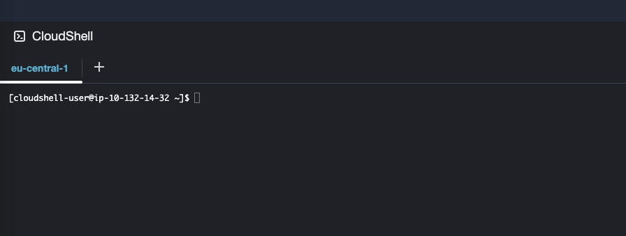

# AWS Cloudshell

A command prompt - or: *shell* - is a text-based interface that allows you to interact with your computer's operating system by typing commands instead of using a graphical user interface (GUI). 

You'll be using a shell for most of the exercises in these tutorials. 

In the command prompt, you can execute various tasks like navigating the file system, running programs, and managing files. It's a powerful tool that gives you greater control over your system, especially for administrative tasks or automation.

Every operating system has its own version of a shell. For the remainder of this tutorial, we will be using **AWS CloudShell**

AWS CloudShell is a browser-based shell that provides you with command-line access to AWS resources. CloudShell makes it easy to manage AWS services, execute scripts, and use Linux tools without leaving the browser.


<mark style="background: #00ced1!important">*__Exercise 1:__ Exploring AWS Cloudshell*</mark>

1. Open [AWS CloudShell compute environment: specifications and software](https://docs.aws.amazon.com/cloudshell/latest/userguide/vm-specs.html)
2. Notice the compute environment resources
3. Notice the pre-installed software
4. Notice the runtimes
5. Notice the development tools and shell utilities

<mark style="background: #00ced1!important">*__Question 1:__ You've seen that cloudshell comes pre-installed with a wide selection of software. Let's delve a little deeper into the tools that come standard with this environment*</mark>

<details>
<summary><mark>Which operating system does cloudshell use?</mark></summary>
<blockquote>
Cloudshell uses <a href="https://aws.amazon.com/linux/amazon-linux-2023/">Amazon linux 2023</a>. AL2023 is a linux distribution that is maintained by AWS to be secure and stable. For the intents of these tutorials, any linux distribution would do.
</blockquote>
</details>
<details>
<summary><mark>How much cpu and ram does cloudshell come with?</mark></summary>
<blockquote>
Cloudshell comes with 1vCPU and 2GB of RAM. This means it's well suited for small tasks, programs, scripting tasks etc, but not for anything heavy. </p>
If you want to run <a href="https://github.com/wojciech-graj/doom-ascii">doom-asci</a> on cloudshell, you technically can I guess ... but probably shouldn't :) 
</blockquote>
</details>
<details>
<summary><mark>What's persistent storage?</mark></summary>
<blockquote>
Persistent storage means: the files and programs you create and install will be there the next time you start your cloudshell environment in the same AWS account. 1GB is not a lot, but it's more than enough for the tasks you should be doing in cloudshell. </p>

It also means that cloudshell costs a little money, even when you're not actively using it. Because the storage is still being used regardless. If you're completely done with your cloudshell environment, or if you don't mind losing the data that is on there, please DELETE your environment. 

You can always start over fresh. 
</blockquote>
</details>
<details>
<summary><mark>What's a cli?</summary>
<blockquote>
CLI stands for command line interface. A lot of cloud platforms, operating systems and programs come with a cli. </p>
A CLI is a collection of small programs that you can run through a command line/shell to run and manipulate a service. </p>
For example: the AWS CLI lets you interact with all AWS services through the command line of your shell environment.
</blockquote> 
</details>
<details>
<summary><mark>What if you want to use files or programs in your cloudshell environment are not pre-installed?</summary>
<blockquote>
The simple answer is: you'll have to either install them, copy them or pull them into your environment. </p>

- For software, you can use the dnf package manager
- For source code, you can use git
- For data files, you can usually use either s3 or git</p>

We'll go into detail for all these options in later courses.
</blockquote> 
</details>

<br>
<br>


<mark style="background: #00ced1!important">*__Exercise 2:__ Starting AWS CloudShell*</mark>

1. Login to an AWS account
2. Locate the  logo at the bottom left and click it
3. After a short wait, your cloudshell environment will be ready:


<mark style="background: #00ced1!important">*__Question 2:__ your prompt looks something like:*</mark>
```shell
[cloudshell-user@ip-10-132-14-32 ~]$
```
<details>
<summary><mark>What does 'cloudshell-user' mean?</mark></summary>
<blockquote>
cloudshell-user is name of your user in your cloudshell environment. It is automatically created for you, along with the rest of the cloudshell environment, when you started cloudshell.
</blockquote>
</details>
<details>
<summary><mark>What does ip-10-132-14-32 mean?</mark></summary>
<blockquote><p>This is the hostname of your cloudshell environment. Behind the scenes, what cloudshell actually is, is a small linux virtual machine, that is created and started for you when you use cloudshell. </p>
<p>For convenience, AWS chose to gave it a hostname that reflects its ip address. But the hostname could just as easily have been 'cloudshell-server'. </p>

If you guessed 'that is the ip address of my cloudshell environment', partial credit.  
</blockquote>
</details>
<details>
<summary><mark>What does ~ mean?</mark></summary>
<blockquote>
The spot of the ~ symbol, or: tilde, indicated in which folder you currently are within the linux file system. ~ is shorthand for your home directory. That might sound a little strange. We'll cover this in more detail in <a href="/01-basic-shell-commands.md">01-basic-shell-commands</a>.
</blockquote>
</details>
<details>
<summary><mark>What does $ mean?</mark></summary>
<blockquote>
This is simply an indication of a command prompt - a place where you can input and run commands on the host.
</blockquote>
</details>
<br>
<br>

## Local shells

Cloudshell is a cloud service - it's a process that runs entirely on a host within AWS, and it does not have any direct connection to your local device. 

The reason we're using cloudshell, is because by using it, you can get up and running quickly without having to install and set up a bunch of software locally. 

Every operating system offers ways to interact with it though a shell or command prompt. If you intend to take development seriously, you'll want to do the local setup. We'll cover this in another section. 

