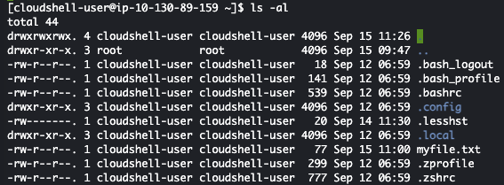

# Basic shell commands
The internet runs on linux - for the vast majority at least. Linux is a lightweight and stable operating system that is the foundation for most websites, web api's and saas services you're likely to encounter. Linux was created in the 90s, and is largely based on Unix. It's open source, meaning that you can see exactly how it is programmed - and make changes to it if you so desire. 

You can run linux on very modest specs, such as raspberry pi's. The small installation footprint that most server-side linux installations have, is due to the fact that linux can be administered effectively through a shell. The resource 

## What You Will Learn:
- Basic Linux file system structure and navigating it
- Creating, editing, viewing and deleting files
- Creating and removing directories
- Using sudo for administrative tasks

## Linux file system structure and navigating it
In Linux, everything is organized in a file system that resembles a tree-like hierarchy. Here are some important directories:

| Directory | Contains |
| --- | --- |
| /home | Contains user-specific data. Each user has a folder inside /home (e.g., /home/username). |
| / | The root directory, where the entire system begins. |

Moving around the file system is done mostly with the ```cd``` and ``` ls``` shell commands, in combination with a few key symbols: 

| Symbol | Represents |
| --- | --- |
| ~ | Your home directory (/home/username). |
| .. | The parent directory (goes one level up in the hierarchy). |
| . | The current directory. |
| ./ | A file or script within the current directory. |


<mark style="background: #00ced1!important">*__Exercise 1:__ moving around the file system*</mark>
>In CloudShell
0. Enter command ```cd ~``` into your shell. 
1. Enter command ``` pwd``` into your shell. \
Notice the that you're currently in your home directory, as indicated by the ~ next to your prompt. \

2. Enter command ``` cd ..```
3. Enter command ``` pwd``` again. \
Which directory are you currently in? Did you notice the change next to your prompt? 
4. Enter command ```ls ``` into your shell. \
What are you currently looking at? 
5. Enter command ```cd /``` into your shell. \
Notice the change next to your prompt.
6. Enter command ```ls ``` \
What are you currently looking at? 


<mark style="background: #00ced1!important">*__Question 1:__ understanding nagivating the linux file system*</mark>

<details>
<summary><mark>What does the cd command do?</mark></summary>
<blockquote>
cd, or 'change directory', does just that - it changes the directory you're in to one you want to get to. cd can be used along with a key symbol - but you can also explicitly navigate to a specific spot in the file structure by typing cd /folder/you/want/to/get/to.
</blockquote>
</details>
<details>
<summary><mark>What does the pwd command do?</mark></summary>
pwd, or 'present working directory', prints the full path of the directory you're currently in. 
</blockquote>
</details>
<details>
<summary><mark>What does the ls command do?</mark></summary>
ls displays all files and directories within your currently directory. 
</blockquote>
</details>
<details>
<summary><mark>How can you get back to your home directory from where you are?</mark></summary>
You can get back to your home directory by typing cd /home/cloudshell-user or cd ~ 
</blockquote>
</details>


### Standard folders on the linux file system
Everything in linux is a file. This means makes linux very configurable and easy to understand once you get the hang of it. It also means that there's a high degree of standardization involved in where files and folders are created and kept. 

You're very likely to find folders below on every linux installation you come across: 

| Directory | Contains |
| --- | --- |
| / | The root directory, where the entire system begins. |
| /bin | essential command binaries for all users |
| /boot | ergegeor all users |
| /dev | device files |
| /etc | Configuration files for the system. |
| /home | Contains user-specific data. Each user has a folder inside /home (e.g., /home/username). |
| /lib | libraries for the essential binairies |
| /media | originally used as mountpoint for removable media - cd's, dvd's - but now mostly deprecated |
| /mnt | temporarily mounted file systems    |
| /opt | add-on application software packages |
| /proc | virtual file system providing process and kernel information |
| /root | home directory for the root user |
| /run | runtime variable data |
| /sbin | essential system binaries |
| /srv | site-specific data served by this system |
| /sys | contains information about devices, drivers and kernel features |
| /tmp | temporary files - often ephemeral |
| /usr | non-essential binaries for all users |
| /var | Variable data files like logs and databases. |
| /var/lock | lock files, files keeping track of resources currently in use |
| /var/log | log files |
| /var/tmp | temporary files that need to be preserved between reboots |

### AWS cloudshell specific folders

AWS linux also features some bespoke directories:
|Directory | Contains |
| --- | --- |
| /aws | erger|
| /certs | erfgewf |
| /local | fewfef |

Over the course of these tutorials you won't be delving very deeply into the inner workings of linux - but it's good to be aware of the structure. 

## Creating, editing, viewing and deleting files


<mark style="background: #00ced1!important">*__Exercise 2:__ working with files*</mark>
>In CloudShell
1. Move to your home directory, and run ```touch myfile.txt```
2. Run ```ls``` \
Notice there's now a file called myfile.txt in your home directory. 
3. Run ```cat myfile.txt``` \
Notice there is no output. This is because the file you created has no content. Let's add some. 
4. Run ```nano myfile.txt``` \
Notice that the look of your shell changed quite a bit. You've started nano. Nano is an in-shell text editor.
5. In nano, type ```Hello, you handsome devil```
6. Hit ctrl + o \
nano will ask which file to write to, and have ```myfile.txt``` selected. Hit enter to confirm.
7. Hit ctrl + x to quit out of nano
8. Run ```cat myfile.txt``` again \
Notice the content of the file is printed. 

Now let's get a little fancier. 

9. Run ```echo "you're giving me the horn, you saucy devil you" > myfile.txt```
10. Run ```cat myfile.txt``` \
What do you see now? What don't you see? 
11. Run ```echo "I could never stay mad at you" >> myfile.txt```
12. Run ```cat myfile.txt```\
How about now? 

<mark style="background: #00ced1!important">*__Question 2:__ interacting with the shell*</mark>
<details>
<summary><mark>What do the up and down arrow keys do?</mark></summary>
<blockquote>
You'll encounter situations where you want to repeat a command a couple of times, or where you'll want to run a command again after making some changes. The up and down arrows allow you to navigate through the commands you've previously types into the shell. 
</blockquote>
</details>
<details>
<summary><mark>What does the tab key do?</mark></summary>
<blockquote>
The tab key offers autocompletion when it can. The nagivating to the root - cd / - and then getting back to your home directory by typing: cd /h [tab to autocomplete to 'home']/c [tab to autocomplete to 'cloudshell-user], and then hitting return. 
</blockquote>
</details>
<details>
<summary><mark>What does the echo command do?</mark></summary>
<blockquote>
echo prints whatever comes after to the screen. This isn't all that useful when typing commands into the shell - since you can already read what's there yourself - but echo can also be used to print useful things like system variables etc. 
</blockquote>
</details>
<details>
<summary><mark>Do I first have to create a file before I can write to it?</mark></summary>
<blockquote>
No, you don't. You can use > or >> to instantly create a file. You can also create one from nano without first having to touch it. In most cases, you'll want to create the file explicity first by using touch. 
</blockquote>
</details>
<details>
<summary><mark>What does the cat command do?</mark></summary>
<blockquote>
cat shows the content of a file - simple as that. 
</blockquote>
</details>


\
\
<mark style="background: #00ced1!important">*__Exercise 3:__ working with files [2]*</mark>
>In CloudShell
1. Move to your home directory, and run ```ls```
2. Now run ```ls -l``` \
Notice the difference. 
3. Run ```ls -a```
Notice the difference
4. Run ```ls -al```


<mark style="background: #00ced1!important">*__Question 3:__ interpreting output from ls*</mark>
<br>
The output you're seeing should look something like this:  



<details>
<summary><mark>What's up with the ., .. and files starting with .?</mark></summary>
<blockquote>
. is shell key word for 'this directory'. <br>
.. is the shell key word for 'parent directory'<br>
<br>
Files and folders starting with . are hidden. They don't show up in regular views, usually because they don't have to. Hidden files are used for hold data that you don't want to accidentally modify, and keeping them hidden makes the user experience neater. You can create and edit hidden files just like you would regular files. 
</blockquote>
</details>
<details>
<summary><mark>What does the string of ten dashes and d/r/w/x's mean?</mark></summary>
<blockquote>
It describes the file type and permissions. <br><br>
The first character represents the type of file:<br> 

- regular file: -
- directory: d
- symbolic link: l<br><br>

The next nine characters represent the permssions:<br>
- r (read), w (write) and x (execute)<br>
- the permissions are grouped into three sets: owner, group, and others.
- in the line for myfile.txt: -rw-r--r--
    - regular file: -
    - owner: rw- (read and write)
    - group: r-- (read only)
    - others: r-- (read only)  

For now, notice that the file you created is owned by you. <br>
We'll revisit permissions in <a href="/09-advanced-shell-commands.md">09-advanced-shell-commands.md</a>
</blockquote>
</details>
<details>
<summary><mark>What does the first row of numbers mean?</mark></summary>
<blockquote>
This is number represents the number of hard links to the file or directory. We'll revisit links in <a href="/09-advanced-shell-commands.md">09-advanced-shell-commands.md</a>
</blockquote>
</details>
<details>
<summary><mark>What do the two columns of names mean?</mark></summary>
<blockquote>
These represent the owner (username) of the file, and the group (groupname) that the owner belongs to. Every linux installation can have multiple users defined, and every user belongs to a group of users. <br><br>
We'll revisit users and groups in <a href="/09-advanced-shell-commands.md">09-advanced-shell-commands.md</a>
</blockquote>
</details>
<details>
<summary><mark>What does the second column of numbers mean?</mark></summary>
<blockquote>
You probably saw this coming - this is the file size in bytes. 
</blockquote>
</details>
<details>
<summary><mark>What about the column of dates?</mark></summary>
<blockquote>
This shows the modification date and time - so the timestamp when the file was last changed. <br>
Notice there can be a difference between the time when a file was created and when it was last changed. 
</blockquote>
</details>
<br>
<br>

<mark style="background: #00ced1!important">*__Exercise 4:__ deleting files*</mark>
>In CloudShell

1. Run ```ls -l``` \
Notice that the file you created before, ```myfile.txt``` is still there. 
2. Run ```rm myfile.txt``` \
3. Run ```ls -l``` \
Notice that ```myfile.txt``` is now gone. 

__Please note__: the ```rm``` will remove a file. It will not ask for confirmation. Only use this if you're sure you're not destroying something you're going to miss. 

## Creating and removing directories

<mark style="background: #00ced1!important">*__Exercise 4:__ working with directories*</mark>
>In CloudShell
1. Move to your home directory, and run ```mkdir new-directory```
2. Now run ```ls -l``` \
Notice there is now a directory called ```new-directory``` in your home directory. 
3. Run ```cd new-directory```
4. Run ```ls -l``` \
Notice the directory is empty. Time to get rid of it. 
5. Move back to your home directory by ```cd ~``` or ```cd ..``` \
Remember why these are the same thing for this step? 
6. Run ```rm -rf ./new-directory```
7. Run ```ls -l``` \
Notice the directory you created has been removed. 

__Please note:__ the ```rm``` command will not remove a directory. \
__Please note:__ the ```rm -rf``` command __will__ remove a directory and all of its sub-directories and contents. It will not ask for confirmation. Only use this if you're sure you're not destroying something you're going to miss. 

## Using sudo for administrative tasks

Not all users on a linux system are created equal. As a regular user, you are not allowed to touch certain files and folders that are essential for the functioning of the system. But ... every now and then, you have to. 

It is bad practice to work with elevated credentials the entire time you're working on the system. If you make a mistake, the consequences could be dire. To hand out elevated credentials when you happen to need them, linux has a construct called __su__ - super user. With __su__ authorisations, you can do anything on the system. 

To give you a bit of __su__ when you need it, you can use the command __sudo__ in front of the command you want to use. In order to be able to use __sudo__ your user has to be added to the file ```/etc/sudoers```. This can only be done by a user with __su__ access itself.

<mark style="background: #00ced1!important">*__Exercise 5:__ sudo in action*</mark>

1. Let's see if your current user, ```cloudshell-user``` is in the sudoers file. Run ```cat /etc/sudoers``` \
Notice that you're not allowed to view the file: 
```bash
cat: /etc/sudoers: Permission denied
```
The good news is: your user is in there by default. \
2. Run ```sudo cat/etc/sudoers``` \
Booyah - your shell window fills up wit the contents of the entire ```sudoers``` file. Feel free to read through it - but if you're in a hurry, scroll to the bottom. 
```bash
## Sudoers allows particular users to run various commands as
## the root user, without needing the root password.
##
## Examples are provided at the bottom of the file for collections
## of related commands, which can then be delegated out to particular
## users or groups.
## 
## This file must be edited with the 'visudo' command.

## Host Aliases
## Groups of machines. You may prefer to use hostnames (perhaps using 
## wildcards for entire domains) or IP addresses instead.
# Host_Alias     FILESERVERS = fs1, fs2
# Host_Alias     MAILSERVERS = smtp, smtp2

## User Aliases
## These aren't often necessary, as you can use regular groups
## (ie, from files, LDAP, NIS, etc) in this file - just use %groupname 
## rather than USERALIAS
# User_Alias ADMINS = jsmith, mikem


## Command Aliases
## These are groups of related commands...

## Networking
# Cmnd_Alias NETWORKING = /sbin/route, /sbin/ifconfig, /bin/ping, /sbin/dhclient, /usr/bin/net, /sbin/iptables, /usr/bin/rfcomm, /usr/bin/wvdial, /sbin/iwconfig, /sbin/mii-tool

## Installation and management of software
# Cmnd_Alias SOFTWARE = /bin/rpm, /usr/bin/up2date, /usr/bin/yum

## Services
# Cmnd_Alias SERVICES = /sbin/service, /sbin/chkconfig, /usr/bin/systemctl start, /usr/bin/systemctl stop, /usr/bin/systemctl reload, /usr/bin/systemctl restart, /usr/bin/systemctl status, /usr/bin/systemctl enable, /usr/bin/systemctl disable

## Updating the locate database
# Cmnd_Alias LOCATE = /usr/bin/updatedb

## Storage
# Cmnd_Alias STORAGE = /sbin/fdisk, /sbin/sfdisk, /sbin/parted, /sbin/partprobe, /bin/mount, /bin/umount

## Delegating permissions
# Cmnd_Alias DELEGATING = /usr/sbin/visudo, /bin/chown, /bin/chmod, /bin/chgrp 

## Processes
# Cmnd_Alias PROCESSES = /bin/nice, /bin/kill, /usr/bin/kill, /usr/bin/killall

## Drivers
# Cmnd_Alias DRIVERS = /sbin/modprobe

# Defaults specification

#
# Refuse to run if unable to disable echo on the tty.
#
Defaults   !visiblepw

#
# Preserving HOME has security implications since many programs
# use it when searching for configuration files. Note that HOME
# is already set when the the env_reset option is enabled, so
# this option is only effective for configurations where either
# env_reset is disabled or HOME is present in the env_keep list.
#
Defaults    always_set_home
Defaults    match_group_by_gid

# Prior to version 1.8.15, groups listed in sudoers that were not
# found in the system group database were passed to the group
# plugin, if any. Starting with 1.8.15, only groups of the form
# %:group are resolved via the group plugin by default.
# We enable always_query_group_plugin to restore old behavior.
# Disable this option for new behavior.
Defaults    always_query_group_plugin

Defaults    env_reset
Defaults    env_keep =  "COLORS DISPLAY HOSTNAME HISTSIZE KDEDIR LS_COLORS"
Defaults    env_keep += "MAIL QTDIR USERNAME LANG LC_ADDRESS LC_CTYPE"
Defaults    env_keep += "LC_COLLATE LC_IDENTIFICATION LC_MEASUREMENT LC_MESSAGES"
Defaults    env_keep += "LC_MONETARY LC_NAME LC_NUMERIC LC_PAPER LC_TELEPHONE"
Defaults    env_keep += "LC_TIME LC_ALL LANGUAGE LINGUAS _XKB_CHARSET XAUTHORITY"

#
# Adding HOME to env_keep may enable a user to run unrestricted
# commands via sudo.
#
# Defaults   env_keep += "HOME"

Defaults    secure_path = /usr/local/sbin:/usr/local/bin:/usr/sbin:/usr/bin:/sbin:/bin:/var/lib/snapd/snap/bin

## Next comes the main part: which users can run what software on 
## which machines (the sudoers file can be shared between multiple
## systems).
## Syntax:
##
##      user    MACHINE=COMMANDS
##
## The COMMANDS section may have other options added to it.
##
## Allow root to run any commands anywhere 
root    ALL=(ALL)       ALL

## Allows members of the 'sys' group to run networking, software, 
## service management apps and more.
# %sys ALL = NETWORKING, SOFTWARE, SERVICES, STORAGE, DELEGATING, PROCESSES, LOCATE, DRIVERS

## Allows people in group wheel to run all commands
%wheel  ALL=(ALL)       ALL

## Same thing without a password
# %wheel        ALL=(ALL)       NOPASSWD: ALL

## Allows members of the users group to mount and unmount the 
## cdrom as root
# %users  ALL=/sbin/mount /mnt/cdrom, /sbin/umount /mnt/cdrom

## Allows members of the users group to shutdown this system
# %users  localhost=/sbin/shutdown -h now

## Read drop-in files from /etc/sudoers.d (the # here does not mean a comment)
#includedir /etc/sudoers.d
cloudshell-user ALL=(ALL) NOPASSWD:ALL
```
There ^. See it, at the last line? That's your ```cloudshell-user```. And because it is in this file, you're allowed to call __sudo__ to view this file. We're not going to discuss what the rest of the file means at this point. For now, just keep in mind that __sudo__ is your friend. \

