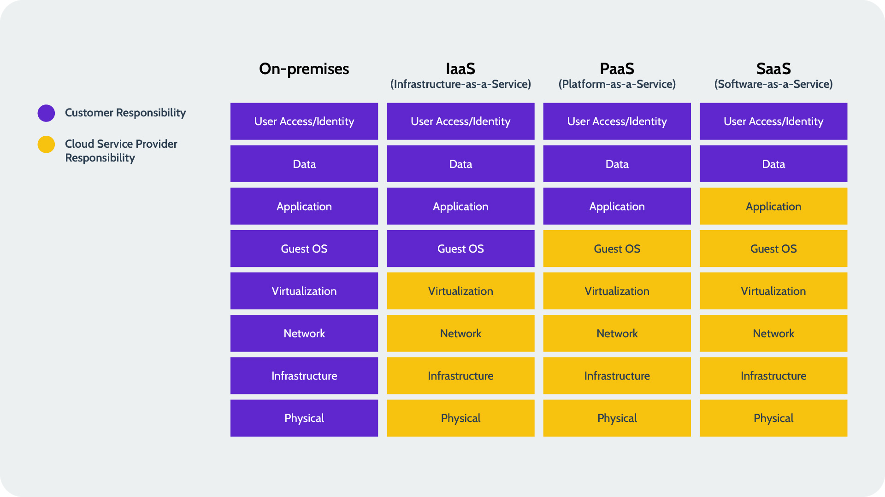
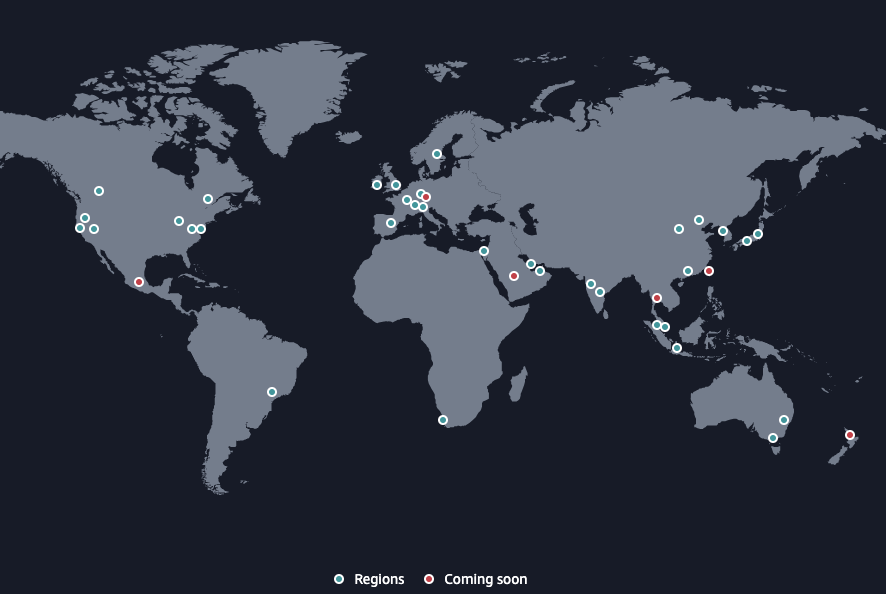
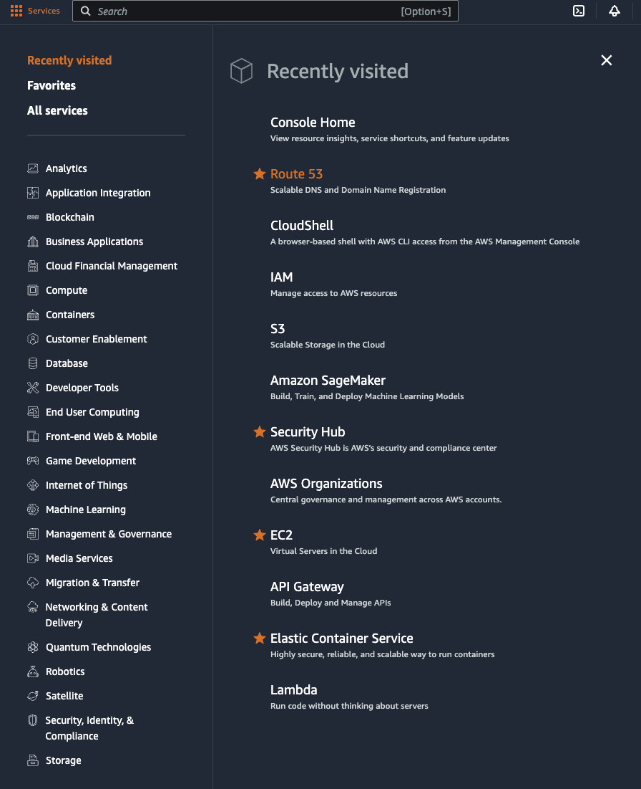

# AWS general concepts and AWS CLI

AWS - Amazon Web Services - is a cloud platform consisting of a lot of different services covering a wide variety of use cases. You've logged into an AWS account. An AWS account is nothing more than a subscription that you can use to run services - it is purely a billing entity. 

## Why consume AWS cloud services? 
- Flexibility: you can provision, test, try and discard services quickly, through either the AWS console, aws cli or Infrastructure as Code (IaC) patterns.
- Cost-effective: you only pay for the compute power, storage and other resources you use without needing a contract or an up-front investment. 
- Reliability: your services run on a scalable, reliable and secure global computing infrasrtucture. 
- Scalability: using AWS tools, autoscaling and elastic loadbalancing your workloads can scale up or down based on demand.
- Security: AWS has a comprehensive approach for securing and hardening its infrastructure, including physical, operational and software measures. 

## IaaS, PaaS, SaaS and the AWS shared responsibility model

Before the rise of cloud platforms, or: hyperscalers, like AWS, Microsoft Azure, Google Cloud etc, you had to own all aspects of your computing infrastructure yourself. From the building where you house your servers, to the power, the networking and everything built on top of it, it was all yours to procure, yours to set up, and yours to maintain. This is referred to as on-premises. 

Cloud services offer opportunities to outright own less of the full stack, and still consume the services you need. The degree to which you have flexibility and control of every element of the stack varies with every pattern. 
 

AWS, and other cloud providers, mostly offer IaaS and Paas services. 

**IaaS** - lets you use servers. \
The operating system you choose to run on those servers, plus the applications, configurations, the data and the user identity and access management are all your responsibility. This includes licenses. \
AWS is responsible for the physical availability of your server, as well as the networking infrastructure and the virtualization layer. \
__Example:__ AWS EC2

**PaaS** - lets you use specific platforms, like databases, without having control about the operating system and other elements further down the stack. \
You're responsible for the specific applications, configuration, data and user identity and access management. \
AWS is responsible for the entire stack up to and including the operating system. \
__Example:__ AWS RDS, AWS Lambda

**SaaS** - lets you use a specific service, without having any direct control over the application and any elements further down the stack. \
You are responsible for the data and user identity and access management. \
AWS doesn't offer SaaS services \
__Example:__ AWS doesn't offer SaaS services - but websites like amazon.com, salesforce.com and heaps of others are SaaS services. 


## AWS global structure

Just like any other data center / IT hosting party, AWS has facilities all over the world. This is where the addage 'the cloud is just someone else's computer' comes from. AWS offers its services through a network of facilities. Have a look at the [AWS global infrastructure map](https://aws.amazon.com/about-aws/global-infrastructure/)



### Regions
AWS currently has 34 regions - with more added steadily. \
An AWS region is a geographic area where Amazon Web Services (AWS) has a cluster of physical data centers. Each region is isolated from the others to ensure the highest levels of security and stability. AWS provides multiple regions across the globe to allow users to deploy resources close to their customers, meet compliance requirements, and ensure redundancy and fault tolerance.

Region characteristics: 
- __Distribution:__ AWS regions are strategically located in different parts of the world (e.g. North America, Europe, Asia-Pacific)
- __Isolation:__ Each region operates independently and is fully isolated from other regions. This ensures that failure in one region does not affect others. 
- __Multiple Availability Zones (AZ's):__ each region contains multiple AZ's, which are physically distinct data centers within that region. AZ's are designed for high availability, with redundant power, networking and connectivity. You can deploy resources across multiple AZ's to increase fault tolerance and availability. 
- __Global vs Regional services__: some AWS services, such as IAM, are global - meaning they are available across all regions. Most services, such as EC2, S3 and RDS are regional - meaning the data and services are confined to the region where they are deployed. 

### Partitions
AWS has several partitions, such as:
- aws (for standard AWS regions)
- aws-us-gov (for AWS GovCloud)
- aws-cn (for China regions)

Partitions are types of regions, that are limited for use. For example, the aws-us-gov region is dedicated for US government workloads, and is not available for any outside party.

These tutorials will function exclusively on AWS standard regions. 

### Availability Zones
 Each region contains multiple AZ's, which are physically distinct data centers within that region. AZ's are designed for high availability, with redundant power, networking and connectivity. 

 AZ's within a region have low latency connections with high bandwidth between them, enabling you to replicate data quickly and create applications that are highly available.

## AWS Services

AWS offers an ever-increasing and ever-changing number of services on their platform. You can get a feel for the number and types of services offered by clicking the 'Services' square at the top left of your AWS console window. 




<mark style="background: #00ced1!important">*__Exercise 1:__ AWS Services*</mark>

1. You can see that services are clustered in groups. Click through the groups to get a feel for the type of services offered. 
2. Search for cloudshell \
Notice that this is the service you've been using so far. 
3. Search for EC2, and hit the star behind the service name \
Notice that the EC2 service is now pinned to your AWS hotbar. 
4. Click on EC2 \
The configuration page for the EC2 service opens up. And there's a lot there.

Through pages like this, you can click your way to configuring a service, starting it, stopping it and scrapping it. 

But most services can also be configured, started, stopped and scrapped programmatically. Think of AWS as one big API (application programming interface), that can be controlled from the command line. 

## AWS CLI

The AWS CLI is a set of commands that allows you to manipulate aws services through API calls from the command line. 

<mark style="background: #00ced1!important">*Exercise 2: using aws cli*</mark>
>In CloudShell
1. Run ```aws --version``` \
Notice that the version of the AWS cli installed on your cloudshell instance is being printed in the terminal window.\
Printing a version of a cli is a way to determine what's installed, and whether it's been installed correctly. 
2. Open a new browser tab and check out the [AWS CLI Command Reference](https://docs.aws.amazon.com/cli/latest/reference/) \
This is documentation for aws cli, that you can use to find more information about the commands and options available. 
3. Run ```aws help``` \
This is the help utility for aws cli. Scroll using the up and down arrows, quit out of this screen by typing ```q``` behind the semicolon. 
4. On the EC2 service page, two security groups are mentioned. Click on Security groups. 

\
Let's see if we can find the same information on the Security Groups page through the aws cli. \
We don't know what exactly to ask the cli for - but it probably has something to do with ```ec2```

5. Run ```aws ec2 help``` \
Notice that there are a lot of options to get through. What we're looking for, is a ```describe``` option that will tell us things about ```security-groups``` \
Scrolling through the extensive list of options, you'll come across the option ```describe-security-groups```. That sounds like the thing we're looking for but we should still check whether it does what we expect it will. 
6. Run ```aws ec2 describe-security-groups help``` \
Read the help documentation for this command. Looks like we found the command we're looking for.  
5. Run ```aws ec2 describe-security-groups``` \
Scroll through the output in your cloudshell and see if you can see the similarities between the text in your shell and the information on the Security Groups page. Quit out by typing ```q``` when you're done. 


### Installing aws cli locally
Having aws cli configured on a local system allows you to run commands that affect AWS services without having to log into the AWS console first. \
If you want to install the aws cli locally, please refer to the [installation instructions](https://docs.aws.amazon.com/cli/v1/userguide/cli-chap-install.html).

__Please note:__ the aws cli does not contain other software what is pre-installed on your cloudshell environment. So if you want to work locally, you will need install other software as well. When relevant, the tutorial will refer you to installation instructions. 

